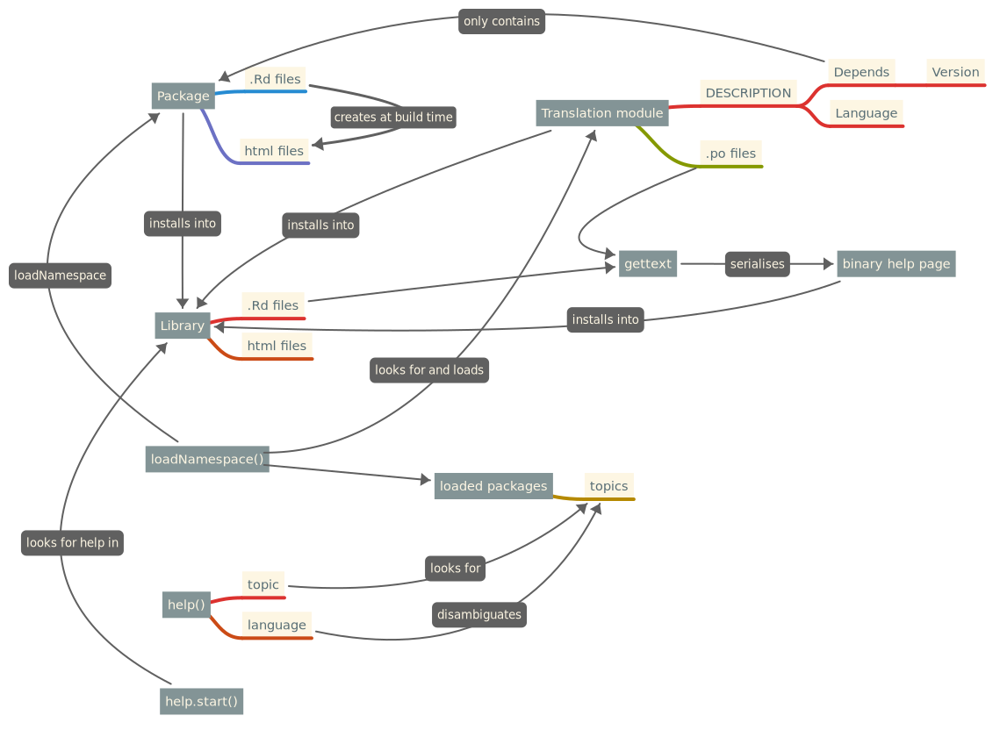

# Internationalisation of R help pages

This repository documents a proposal to support internationalisation of R help pages.

This project started at the 2023 R Project Sprint.
More [in this issue](https://github.com/r-devel/r-project-sprint-2023/issues/35).

## How it's supposed to work

-   Original packages have their "canonical" help pages written in the original languages.

-   Translations are hosted in a translation module that uses the package format.
    Users can install those modules themselves.
    These modules use the PackageType field to indicate that they are a translation module (e.g. PackageType: translation).
    The Depends field is used to indicate the package being translated and the minimum version supported.

-   Translation modules would store .po files with the translated strings.

-   At install time, the .Rd files of the original package are parsed and translated using `gettext()` and the .po files in the translation module and serialised into binary help pages (like regular packages have).

-   When loading a package, R will also search for installed translations and load them too.

-   `help()` gains an new "language" argument which defaults to `Sys.getenv("LANGUAGE")`.

-   `help()` searches for the loaded topics.
    If any translation is available, then it would use the `language` argument to disambiguate.

-   Help pages should include a link to the original (canonical) documentation.

## Concept map

## Changes needed

1.  Changes to CRAN to accept, manage, check and distribute translation modules.
2.  Change to `install.packages()` to install the translation modules.
3.  Possibly improvements to the Rd parser.
4.  Changes to `loadNamespace()` to also load the translation module.
5.  Changes to `help()` and `help.start()` to understand the language
6.  Changes to the help rendering system to add links to the canonical language and perhaps to the other installed languages.

## Things to discuss

#### Can translation modules have dependencies?

Communities or maintainers might like to provide a single installation point for a family of packages (i.e. the tidyverse maintainers might want to provide a tidyverse_es packages).

#### Automatically fetch available translations for all installed packages

A user could want to just install translation for all the available packages without needing to know the names of the modules.
An `update_translations()` function could look at the installed packages, query CRAN for available translations and install them.

A possible issue would be what to do if a package has multiple translation in a particular language, should both be installed?

## Next steps

1.  Figure out if we can actually parse Rd files and use `gettext()` to translate them. If this doesn't work the rest is a no go, so this is sine qua non
    1.  Revise and possibly improve the Rd parser
    2.  Create valid .po files
    3.  use `gettext()` to replace strings
    4.  serialise the output

## Alternative implementations (and why they were rejected)

### Each package hosts all the .Rd files with translations

This would be relatively easy to implement, but

-   it adds a lot of burden to package maintainers.

-   forces users to potentially install unusable translations.

### Translation modules host .Rd files

This would potentially ease the burden on package maintainers since community translations would be potentially independent from the original package, but

-   without formal .po files, translations are hard to check programmatically
